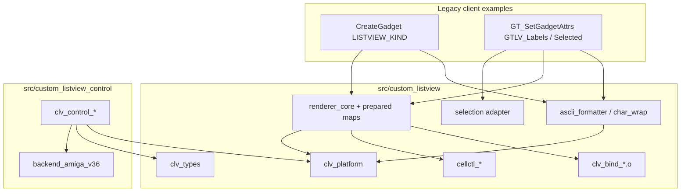
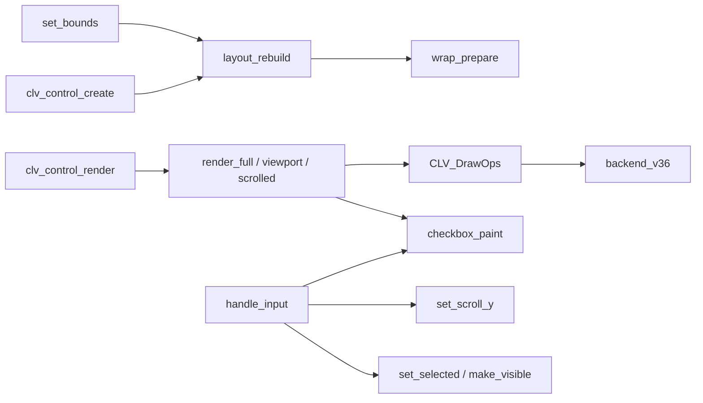
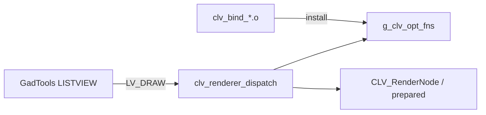

# ListView Dependency Map

**Companion to:** `LISTVIEW_ARCHITECTURE_FILE_AUDIT.md`  
**Date:** 2026-07-31

---

## 1. Module-level dependency list

### Legacy root modules

| Module | Objects | Depends on |
|---|---|---|
| platform | `clv_platform.o` | Amiga AllocMem |
| ascii_formatter | `clv_ascii_formatter.o` | platform, exec list, log |
| ascii_columns | `clv_ascii_columns.o` | platform, types, path_core, log |
| columns | `clv_columns.o` | platform |
| sort | `clv_sort.o` | platform |
| cell_tracking | `clv_cell_tracking.o` | ascii geometry |
| path_core / path | `clv_path_core.o`, `clv_path.o` | platform |
| char_wrap | `clv_char_wrap.o` | ascii, path, platform |
| renderer_core | `clv_renderer_core.o`, `prepared_display_map.o`, `renderer_columns.o`, `renderer_ops.o`, `renderer_setup.o` | platform, ascii_columns, gadtools LVDrawMsg, ops table |
| bind_* | one of `clv_bind_*.o` | installs into `g_clv_opt_fns` |
| selection | `clv_selection.o` | prepared maps, `GTLV_Selected` |
| pixel_wrap | `clv_pixel_wrap.o` | renderer internals (via install) |
| icons / styles | `clv_icons.o`, `clv_styles.o` | renderer ops |
| details | `clv_details.o`, `clv_details_prepare.o` | renderer prepare/ops |
| cellctl | `clv_cellctl_core.o`, `checkbox.o`, `geom.o` | renderer, selection, gadget geometry |

### RichListview root modules

| Module | Objects | Depends on |
|---|---|---|
| control core | `clv_control.o` | platform alloc, layout, scroll, render |
| layout | `clv_control_layout.o` | platform, wrap, `CLV_PixelColumn` |
| wrap | `clv_control_wrap.o` | platform, draw_ops measure (forked algo) |
| render | `clv_control_render.o` | draw_ops, checkbox |
| checkbox | `clv_control_checkbox.o` | draw_ops |
| input | `clv_control_input.o` | checkbox, scroll, layout |
| scroll | `clv_control_scroll.o` | control state only |
| backend v36 | `clv_backend_amiga_v36.o` | platform, graphics, optional bench |
| log (optional) | `clv_control_log.o` | DOS |

### Generic / shared modules

| Module | Consumers |
|---|---|
| `clv_platform*` | Legacy all profiles + Rich control |
| `clv_types.h` (`CLV_CellAlign`, `CLV_PixelColumn`) | Legacy + Rich public header |
| `clv_bench*` | Rich bench build (optional) |
| `clv_compiler.h`, `clv_sdk_compat.h` | Legacy (and potentially Rich later) |
| `clv_sort*`, `clv_path*` | Legacy only today; algorithmically generic |
| `clv_cellctl_geom*` | Legacy cellctl + host tests; parallel to control checkbox geom |

---

## 2. Cross-architecture edges

```text
custom_listview_control  --include-->  custom_listview/clv_types.h
custom_listview_control  --include-->  custom_listview/clv_platform.h
custom_listview_control  --include-->  custom_listview/clv_platform_internal.h
custom_listview_control  --include-->  custom_listview/clv_bench_internal.h
custom_listview_control  --link----->  clv_platform.o
custom_listview_control  --link----->  clv_bench.o          (bench only)
clv_control_wrap.c       --forked--->  algorithm from clv_pixel_wrap.c (no link)
CLV_CTRL_WRAP_* enums    --mirror--->  CLV_PIXEL_WRAP_* numeric values (soft)
```

**No** edge from control to renderer, selection, ascii formatter, binders, or cellctl objects.

**Reverse edges:** none required — legacy does not call into `custom_listview_control/`.

---

## 3. Function-pointer / binder dependencies

Legacy optional features are **not** hard-linked from renderer core:

```text
clv_renderer_create
  → clv_renderer_bind_optional()   /* defined in exactly one clv_bind_*.o */
       → clv_pixel_wrap_install / clv_icons_install / clv_styles_install / clv_cellctl_install
  → g_clv_opt_fns (clv_renderer_ops.o) holds function pointers
```

Marking any `clv_bind_*.c` as dead because nothing “calls it by name” from other `.c` files is incorrect — the linker resolves `clv_renderer_bind_optional`.

Rich draw path uses an explicit `CLV_DrawOps` table supplied at `clv_control_create` (backend installs concrete function pointers).

---

## 4. Suspected dead / unreferenced modules

| Item | Assessment |
|---|---|
| `examples/*_stub.c` | Likely historical stubs — verify Makefile before delete |
| Host `.exe` under `tests/host/` | Build artefacts; not source |
| `clv_cellctl_*` | **Not dead** — linked by `draw-cellctl-checkbox`; product-superseded by control |
| Binders | **Not dead** — required by drawn profiles |
| `clv_log.h` | Header-only; used widely as no-op macros |

---

## 5. Mermaid graphs

### 5.1 Architecture overview



### 5.2 RichListview internal call graph



### 5.3 Legacy drawn paint path



---

## 6. Profile → object quick reference

See `docs/CLV_BUILD_PROFILES.md` and root `Makefile` lines defining `CLV_ASCII_*_LIBS`, `CLV_DRAW_*_LIBS`, `CLV_FULL_LIBS`, `CLV_CUSTOM_CONTROL_LIBS`. Prefer the Makefile when docs omit `path_core` on ascii-minimal.
